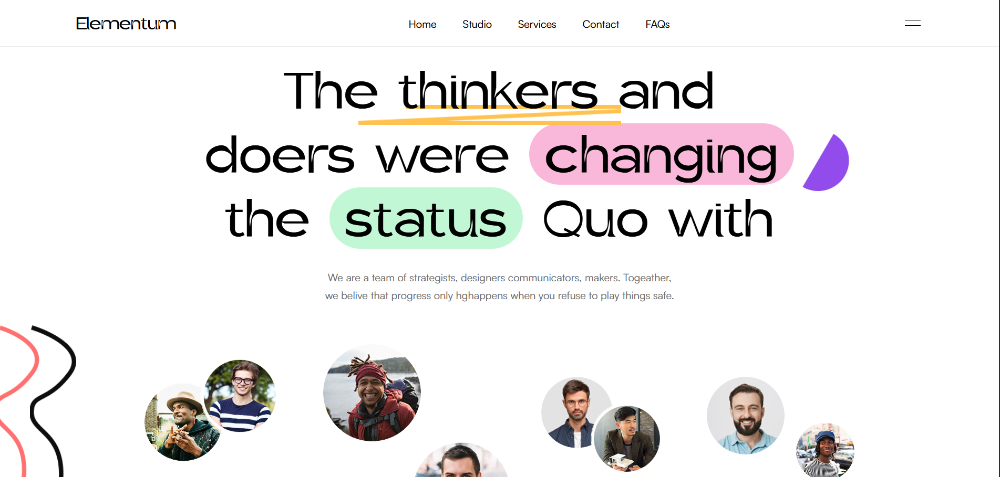

<h2>Live project link:- https://figma-to-react-coral.vercel.app/ </h2>

# Elementum

A fully responsive multi-section marketing website built with React and Vite, converted from a Figma design to production-ready code — with no CSS frameworks.



---

## Features

- Pixel-accurate implementation from Figma design
- Fully responsive across all screen sizes (xxl → xs)
- Scroll-triggered reveal animations using IntersectionObserver (no external library)
- Interactive hover effects on buttons, links, and service rows
- Custom grid system (12-column) built from scratch
- Custom fonts: Gerbil (headings) + Satoshi (body)
- Sticky navbar with animated hamburger menu toggle

---

## Sections

| Section | Description |
|---|---|
| **Navbar** | Sticky, burger toggle on all screens, mobile dropdown |
| **Hero** | Large heading with highlights, floating team faces, decorative elements |
| **About** | Two-block layout with circular images, read more links |
| **Services** | Service list with animated arrow on hover |
| **Testimonial** | Quote card with floating avatars, dashed guide lines |
| **Footer** | Newsletter CTA, 4-column links grid, copyright |

---

## Tech Stack

- **React 19** — component-based UI
- **Vite 8** — fast dev server and build tool
- **Pure CSS** — custom properties, no Tailwind or Bootstrap
- **IntersectionObserver API** — scroll reveal animations

---

## Project Structure

```
src/
├── assets/
│   ├── elements/        # Decorative SVG/PNG shapes
│   └── images/          # Section images (hero, about, testimonial)
├── components/
│   ├── Navbar.jsx
│   ├── Hero.jsx
│   ├── About.jsx
│   ├── Services.jsx
│   ├── Testimonial.jsx
│   └── Footer.jsx
├── fonts/               # Gerbil.otf, Satoshi-Regular.otf
├── hooks/
│   └── useScrollReveal.js
├── App.css              # All component styles
├── index.css            # Global styles, CSS variables, grid
└── meadia.css           # All responsive breakpoints (xxl → xs)
```

---

## Getting Started

```bash
# Install dependencies
npm install

# Start development server
npm run dev

# Build for production
npm run build
```

---

## Responsive Breakpoints

| Breakpoint | Range |
|---|---|
| xxl | ≥ 1400px |
| xl | 1200px – 1399px |
| lg | 992px – 1199px |
| md | 768px – 991px |
| sm | 576px – 767px |
| xs | ≤ 575px |

---

## CSS Variables

```css
--pri-font: 'Gerbil'                    /* Headings */
--sec-font: 'Satoshi'                   /* Body text */
--secondary-color: rgb(215, 238, 221)   /* Mint green (footer bg) */
--text-color-light: #707070
--gw: 15px                              /* Grid gutter */
```
